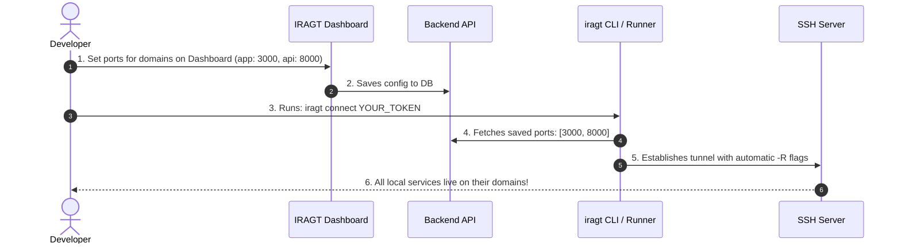

# Walkthrough: Single-Command Zero-Flag Multi-Port Tunnel System

We have implemented the complete end-to-end flow allowing developers to manage multi-port and domain assignments entirely from the website dashboard, and connect their local services with **one single command** without typing any `-R` flags.

---

## 1. Summary of Changes

### Backend & API
- **Added `GET /api/v1/configs/cli/{token}`** in [`app/api/routers/configs.py`](file:///opt/iragt/app/api/routers/configs.py#L79):
  - Fetches the saved multiport settings (`multiport:{token}`) for the token.
  - Automatically returns SSH connection parameters (`ssh_host`, `ssh_port`) and all active domain-to-local-port mappings.
- **Added `/run` and `/install.sh` Web Endpoints** in [`app/main.py`](file:///opt/iragt/app/main.py#L154):
  - `GET /run`: Serves the universal one-line bash runner script.
  - `GET /install.sh`: Serves the global installer for placing `iragt` in `/usr/local/bin`.

### Client Packages (NPM & Python)
- **NPM Package** in [`packages/npm/`](file:///opt/iragt/packages/npm/):
  - `package.json` with binary definition for `iragt` command.
  - `bin/iragt.js`: Node.js CLI that fetches token configuration and connects via SSH with all `-R` ports auto-bound.
- **Python Package** in [`packages/python/`](file:///opt/iragt/packages/python/):
  - `pyproject.toml` with `iragt = "iragt.cli:main"` entrypoint.
  - `src/iragt/cli.py`: Python CLI implementation.

### Web Dashboard & Branding
- **Integrated `logo.png` across all frontend layouts**:
  - Favicon in [`index.html`](file:///opt/iragt/index.html).
  - Public navigation & footer in [`src/components/PublicLayout.jsx`](file:///opt/iragt/src/components/PublicLayout.jsx).
  - User dashboard header in [`src/pages/dashboard/DashboardLayout.jsx`](file:///opt/iragt/src/pages/dashboard/DashboardLayout.jsx).
  - Admin header in [`src/pages/admin/AdminLayout.jsx`](file:///opt/iragt/src/pages/admin/AdminLayout.jsx).
  - Auth/Login header in [`src/pages/Login.jsx`](file:///opt/iragt/src/pages/Login.jsx).
  - Guide navbar in [`src/pages/Guide.jsx`](file:///opt/iragt/src/pages/Guide.jsx).
- **Updated [`src/pages/dashboard/ConfigureTunnel.jsx`](file:///opt/iragt/src/pages/dashboard/ConfigureTunnel.jsx)**:
  - Added dedicated **🚀 CLI (iragt)** and **⚡ cURL / Bash** command tabs.
  - Generates `iragt connect <TOKEN>` and `npx iragt connect <TOKEN>` for instant one-click copying.
  - Rebuilt production assets with `npm run build`.

---

## 2. How the Flow Works for Users



---

## 3. How to Run & Connect

### Method 1: Instant Run with `npx` (No Install)
```bash
npx iragt connect YOUR_TOKEN
```

### Method 2: Global NPM Install
```bash
npm install -g iragt
iragt connect YOUR_TOKEN
```

### Method 3: Python Pip
```bash
pip install iragt
iragt connect YOUR_TOKEN
```

### Method 4: Universal 1-Line cURL Runner
```bash
curl -sSL https://iraglobaltech.com/run | bash -s YOUR_TOKEN
```

---

## 4. How to Publish the Packages

### To Publish on NPM:
```bash
cd /opt/iragt/packages/npm
npm login
npm publish --access public
```

### To Publish on PyPI (Python):
```bash
cd /opt/iragt/packages/python
pip install build twine
python -m build
twine upload dist/*
```
